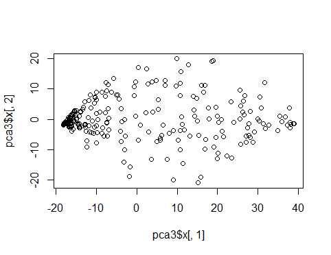
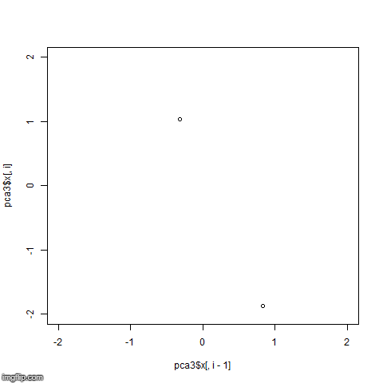
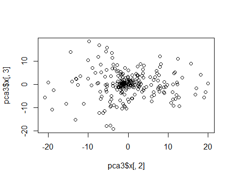
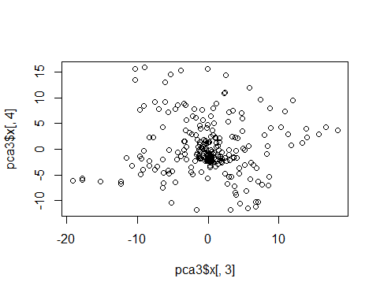

# Multidimensional data analysis - Gross home assignment 
## Andrey Volkov, BBI 174

### 1. Principal component analysis. Consider Example: Handwritten Digits

a) Perform the PCA for these data (perhaps, via singular value decomposition)

First, let us declare the variable of base data set link and read all the observations to variable "digits3".
Let us use `prcomp()` function to perform a principal component analysis on our data set, using `t()` function to transpose data set. 
~~~python
baseDataSetLink <- "https://web.stanford.edu/~hastie/ElemStatLearn/datasets/zip.digits/train.%s"

digit3 <- read.csv(sprintf(baseDataSetLink, 3), header = FALSE)
pca3 <- prcomp(t(digit3), scale = TRUE)
~~~
Let us have a closer look on how `prcomp()` function works. Basically, we have to calculate the average measurement for all the observations in each row. 
With the average value we can calculate the center of the data. Now we can shift the data, so the center of the plot has the same coordinates as the calculated average measurement.
Now, when data is centered on the origin, we can try to fit a line to it. To do it, we can start to draw a rnadom line that goes through the origin. Then we rotate the line until it fits the data as well as it can.

How PCA decides, if it fit is good or not, so let's go back to the original line, that goes through the origin. To quantify how good this line fits the data, PCA projects the data onto it.
And then it finds the line that that maximizes the distances from the projection points to the origin.

So the PCA finds the best fitting line by maximizing the sum of the square distances from the projected point to the origin. So, for this line, PCA projects the data onto it and then measures the distance from this point to the origin. (d1, d2, d3, ...) -> (d1^2 + d2^2 + d3^3 + ...) = SS (distances). So, therefore we find the line with the largest sum of squares distances. This line is called the PC1 - Principal component 1. 

Because it is only 2-D graph, PC2 is simply the line through the origin that is perpendicular to PC1, without any further optimization that has to be done. 
The same way to find the singular vector and the eigen vector. To draw the final PCA plot we simply rotate everything, so the PCA1 is horizontal.
Then we use the projection points to find out where the PCA plot go in the PCA plot.  

Now we can call the `prcomp()` function to do a PCA on our data. With a goal to draw a graph that shows how the variables are related to each other.
Because by default the function expects the variables be rows and observation to be columns we use `t()` function to transpose our matrix. 

Use `names()` function to explore the result of the PCA.
~~~
names(pca3) # "sdev" "rotation" "center" "scale" "x"
~~~
In order to extract all the PCAs, we have to call `x` variable on our PCA object.
Plotting the data is rather simple by just calling the `plot()` function with PCA1 and PCA2.
~~~
plot(pca3$x[,1], pca3$x[,2])
~~~

Now let us create the gif image that shows, how all PCAs one by one makes better picture of how each of data points related to each other.
In separate folder create an image of each PCAs.
~~~
for (i in 2:256) {
  file <- paste("plot/", i, ".png", sep = "")
  png(filename=file)
  plot(pca3$x[,i-1], pca3$x[,i], xlim = c(-2, 2), ylim = c(-2, 2))
  dev.off()
}
~~~

Now, let us add a few higher dimensions: PC3 and PC4 and see the difference.
~~~
plot(pca3$x[,2], pca3$x[,3])
~~~

~~~
plot(pca3$x[,3], pca3$x[,4])
~~~

### 2. Bias-variance trade-off. Let N be the total length of your first and last names. Also, choose a random number a ∈ [0.4, 0.6] and round it to one decimal place.