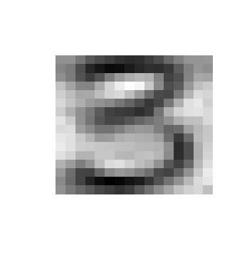

# Multidimensional data analysis - Gross home assignment 
## Andrey Volkov, BBI 174

### 1. Principal component analysis. Consider Example: Handwritten Digits

#### a) Perform the PCA for these data (perhaps, via singular value decomposition)

First, let us declare the variable of base data set link and read all the observations to variable "digits3".
Now we use `prcomp()` function to perform a principal component analysis on our data set.
Because by default the function expects the variables to be rows and observation to be columns we can use `t()` function to transpose our matrix. 
~~~r
baseDataSetLink <- "https://web.stanford.edu/~hastie/ElemStatLearn/datasets/zip.digits/train.%s"

digits3 <- read.csv(sprintf(baseDataSetLink, 3), header = FALSE)
pca3 <- prcomp(t(digits3), scale = TRUE)
~~~
Let us have a closer look on how `prcomp()` function works. Basically, we have to calculate the average measurement for all the observations in each row. 
With the average value we can calculate the center of the data. Now we can shift the data, so the center of the plot has the same coordinates as the calculated average measurement.
Now, when data is centered on the origin, we can try to fit a line to it. To do it, we can start to draw a random line that goes through the origin. Then we rotate the line until it fits the data as best as it can.

To quantify how good this line fits the data, PCA projects the data onto it.
And then it finds the line that that maximizes the distances from the projection points to the origin.

So the PCA finds the best fitting line by maximizing the sum of the square distances from the projected point to the origin. 
So, for this line, PCA projects the data onto it and then measures the distance from this point to the origin. (d1, d2, d3, ...) -> (d1^2 + d2^2 + d3^3 + ...) = SS (distances). 
So, therefore we find the line with the largest sum of squares distances. This line is called the PC1 - Principal component 1. 

Because it is only 2-D graph, PC2 is simply the line through the origin that is perpendicular to PC1, without any further optimization that has to be done. 
The same way to find the singular vector and the eigenvector. To draw the final PCA plot we simply rotate everything, so the PCA1 is horizontal.
Then we use the projection points to find out where the PCA plot go in the PCA plot.  

To have a better understanding let us see how much variation in the original data PC1 accounts for. We can calculate the square of standard deviation.
And then calculate the percentages of the variance. Finally, use `barplot()` function to plot the result.  
~~~r
makeBarPlot <- function(pca, digit) {
  pca.variance.percentages <- round(pca$sdev^2 / sum(pca$sdev^2) * 100, 1)
  
  barplot(
    pca.variance.percentages,
    main=paste("Scree Plot - Handwritten Digits", digit),
    xlab="Principal Component", 
    ylab="Percent Variation", 
    xlim=c(0, 30)
  )
}

makeBarPlot(pca3, 3)
~~~

We can see that first 2 components accounts for the majority of the variation of the data.

#### b) Reproduce Figure 14.23 showing the relevant code. Discuss the plot. Take another digit (other than 3) and repeat.
Now let us make the PC1 and PC2 2-D plot, By choosing first and second column in the result for `x` in PCA.

Also we use `pca.variance.percentages` value for each principal component to display the variance in percents on the plot. 
~~~r
makePCAPlot <- function(pca, digit) {
  pca.variance.percentages <- round(pca$sdev^2 / sum(pca$sdev^2) * 100, 1)
  pca.data <- data.frame(Sample=rownames(pca$x), X = pca$x[,1], Y = pca$x[,2])
  
  ggplot(data = pca.data, aes(X, Y, label=Sample)) + geom_point(color = "steelblue") +
    xlab(paste("PC1 - ", pca.variance.percentages[1], "%", sep="")) +
    ylab(paste("PC2 - ", pca.variance.percentages[2], "%", sep="")) +
    theme_bw() + ggtitle(paste("Handwritten Digit", digit, "PCA Graph"))
}

makePCAPlot(pca3, 3)
~~~

~~~
makePCAPlot(pca3, 3)
~~~

Now, let us take another digit - 5 and compare the differences.
~~~r
digits5 <- read.csv(sprintf(baseDataSetLink, 5), header = FALSE)
pca5 <- prcomp(t(digits5), scale = TRUE)

makeBarPlot(pca5, 5)
~~~

~~~
makeBarPlot(pca5, 5)
~~~

#### c) Explain in words Eq.(14.55) in detail (structure, in what basis it is written, possible use). Use the PCA terminology (e.g., “scores”, etc).

Let us create function that has a parameter with vector and creates an image
~~~r
makeImage <- function(vector) {
  matrix_ <- matrix(as.numeric(vector), 16, 16)
  image(-matrix_[,ncol(matrix_):1], axes = F, col = grey(seq(0, 1, length = 256)))
}
~~~
Now we can simply call this function and get desired result
~~~r
makeImage(colMeans(digit3))
~~~

~~~r
makeImage(pca3$x[,2])
~~~

~~~r
makeImage(pca3$x[,3])
~~~

#### d) Using the PC scores for some observation, reconstruct it in the original space, visualize it and compare the reconstructed image with the original one
In order to use PC scores, and result of SVD, let us call function `PCA()` from `FactoMineR` package and get needed variables.

 

### 2. Bias-variance trade-off. Let N be the total length of your first and last names. Also, choose a random number a ∈ [0.4, 0.6] and round it to one decimal place.