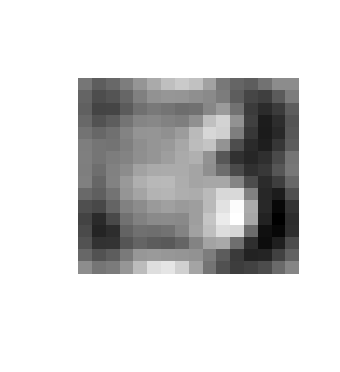

# Multidimensional data analysis - Gross home assignment 
## Andrey Volkov, BBI 174

### 1. Principal component analysis. Consider Example: Handwritten Digits

#### a) Perform the PCA for these data (perhaps, via singular value decomposition)

First, let us declare the variable of base data set link and read all the observations to variable "digits3".
Now we use `prcomp()` function to perform a principal component analysis on our data set.
Because by default the function expects the variables to be rows and observation to be columns we can use `t()` function to transpose our matrix. 
~~~r
baseDataSetLink <- "https://web.stanford.edu/~hastie/ElemStatLearn/datasets/zip.digits/train.%s"

digits3 <- read.csv(sprintf(baseDataSetLink, 3), header = FALSE)
pca3 <- prcomp(t(digits3), scale = TRUE)
~~~
Let us have a closer look on how `prcomp()` function works. Basically, we have to calculate the average measurement for all the observations in each row. 
With the average value we can calculate the center of the data. Now we can shift the data, so the center of the plot has the same coordinates as the calculated average measurement.
Now, when data is centered on the origin, we can try to fit a line to it. To do it, we can start to draw a random line that goes through the origin. Then we rotate the line until it fits the data as best as it can.

To quantify how good this line fits the data, PCA projects the data onto it.
And then it finds the line that that maximizes the distances from the projection points to the origin.

So the PCA finds the best fitting line by maximizing the sum of the square distances from  projected point to the origin. 
So, for this line, PCA projects the data onto it and then measures the distance from this potheint to the origin. (d1, d2, d3, ...) -> (d1^2 + d2^2 + d3^3 + ...) = SS (distances). 
So, therefore we find the line with the largest sum of squares distances. This line is called the PC1 - Principal component 1. 

Because it is only 2-D graph, PC2 is simply the line through the origin that is perpendicular to PC1, without any further optimization that has to be done. 
The same way to find the singular vector and the eigenvector. To draw the final PCA plot we simply rotate everything, so the PCA1 is horizontal.
Then we use the projection points to find out where the PCA plot go in the PCA plot.  

To have a better understanding let us see how much variation in the original data PC1 accounts for. We can calculate the square of standard deviation.
And then calculate the percentages of the variance. Finally, use `barplot()` function to plot the result.  
~~~r
makeBarPlot <- function(pca, digit) {
  pca.variance.percentages <- round(pca$sdev^2 / sum(pca$sdev^2) * 100, 1)
  
  barplot(
    pca.variance.percentages,
    main=paste("Scree Plot - Handwritten Digits", digit),
    xlab="Principal Component", 
    ylab="Percent Variation", 
    xlim=c(0, 30)
  )
}

makeBarPlot(pca3, 3)
~~~

We can see that first 2 components accounts for the majority of the variation of the data. At the same time first 15 components accounts for 80% of the total variation and 34 components for 90%. 

#### b) Reproduce Figure 14.23 showing the relevant code. Discuss the plot. Take another digit (other than 3) and repeat.
Now let us make the PC1 and PC2 2-D plot, By choosing first and second column in the result for `x` in PCA.

Also we use `pca.variance.percentages` value for each principal component to display the variance in percents on the plot. 
~~~r
makePCAPlot <- function(pca, digit) {
  pca.variance.percentages <- round(pca$sdev^2 / sum(pca$sdev^2) * 100, 1)
  pca.data <- data.frame(Sample=rownames(pca$x), X = pca$x[,1], Y = pca$x[,2])
  
  ggplot(data = pca.data, aes(X, Y, label=Sample)) + geom_point(color = "steelblue") +
    xlab(paste("PC1 - ", pca.variance.percentages[1], "%", sep="")) +
    ylab(paste("PC2 - ", pca.variance.percentages[2], "%", sep="")) +
    theme_bw() + ggtitle(paste("Handwritten Digit", digit, "PCA Graph"))
}

makePCAPlot(pca3, 3)
~~~

First two principal components with corresponding percentage of variance.

Now, let us take another digit - 5 and compare the differences.
~~~r
digits5 <- read.csv(sprintf(baseDataSetLink, 5), header = FALSE)
pca5 <- prcomp(t(digits5), scale = TRUE)

makeBarPlot(pca5, 5)
~~~

Comparing the results from the previous observation, here only first three principal components accounts for the majority of the variation of the data (52%). 
But the following columns are bigger in comparison with previous plot. So, first 17 principal components accounts for 80% of the whole variation and first 36 for 90%. 
~~~
makePCAPlot(pca5, 5)
~~~

Here the graphs are rather the same with the exception of wider scatter in the previous one.

#### c) Explain in words Eq.(14.55) in detail (structure, in what basis it is written, possible use). Use the PCA terminology (e.g., “scores”, etc).

In this equation the first parameter is the average vector represented as image for all of the 256 variables.
The v1 - eigenvector for PC1 and v2 - eigenvector for PC2. So, it is a graphical interpretation of the new parameter (λ). 

Let us create function that has a parameter with vector and creates an image
~~~r
makeImage <- function(vector) {
  matrix_ <- matrix(as.numeric(vector), 16, 16)
  image(-matrix_[,ncol(matrix_):1], axes = F, col = grey(seq(0, 1, length = 256)))
}
~~~
In order to get the first three, we can simply call `colMeans()` function to get the average value for each column and call our `makeImage()` function giving this parameter.
~~~r
makeImage(colMeans(digit3))
~~~

In order to use PC scores, and result of SVD, let us call function `PCA()` from `FactoMineR` package and get needed variables.
And now we can access eigenvectors (first and second ones) to draw the corresponding images.
~~~r
digits3_pca <- PCA(digits3)
makeImage(digits3_pca$svd$V[,1])
~~~

~~~r
makeImage(digits3_pca$svd$V[,2])
~~~

Here we displayed first two principal components directions - two vectors as images. In total, there are 256 PCs, however, as I mentioned in point (a), first two ones accounts for the majority of variation in the data.
Having a closer look, we can notice that the v1 (horizontal movement) mainly accounts for the lengthening of the lower tail of the three, at the same time v2 (vertical movement) accounts for character thickness. 

#### d) Using the PC scores for some observation, reconstruct it in the original space, visualize it and compare the reconstructed image with the original one

Let us use fourth observation and make a plot for each 

~~~
makeImage(pca3$x[,4])
makeImage(digits3[4,])
~~~

### 2. Bias-variance trade-off. Let N be the total length of your first and last names. Also, choose a random number a ∈ [0.4, 0.6] and round it to one decimal place.

#### a, b) Generate 80 observations containing N independent variables Xi , i = 1, ..., N (predictors) and one response Y . All of the predictors are distributed over the interval [0, 1] independently and uniformly. This is your training set. The response variable takes just two values, 0 and 1. Generate a separate test set of 100 points.

Let us declare basic variables and functions to generate matrices of observations and result one.

~~~r
library(gmodels)
library(class)

n = 12 # length(Andrey Volkov) == 12
a <- round(runif(1, 0.4, 0.6), 1) # generate and round random distribution

# generates matrix of ${observation_count} observations
getX <- function (observationCount) {
  return (matrix(runif(n, 0, 1), observationCount, n))
}

# crates Y result vector for specific X matrix by specific rule
getY <- function(observations) {
  observationsCount <- length(observations[,1])
  Y <- matrix(0, observationsCount, 1)
  for(i in 1:observationsCount) { if (observations[i, 1] > a) { Y[i,1] <- 1 } }
  return (Y)
}
~~~

Now, we can call the above functions and prepare the training and test sets.

~~~r
xTrain = getX(80)
yTrain = getY(xTrain)

xTest = getX(100)
yTest = getY(xTest)
~~~

#### c) Consider the KNN regression (set prob=T in the knn command; also, use attr(knnModel,"prob") to get the vote probabilities).

In this point we consider KNN regression that basically stores all possible cases anf predict the numerical target based on distance function.
Now, let us create function for getting error for knn regression. Here we make a matrix with fixed number of "K" rows of error.
Then we calculate knn regression using `knn()` function, add "prob" attribute and compute the estimated values of Y according to the given formula. 

~~~r
# Check knn prediction with different k levels
getError <- function(k_num, xTrain_, xTest_, yTrain_, yTest_) {
  error <- matrix(0, k_num, 1)
  
  for (i in 1:k_num) {
    knnPred <- knn(xTrain_, xTest_, yTrain_, prob = T, k = i)
    probPred <- attr(knnPred, "prob")
    
    reg <- probPred * (as.numeric(knnPred) - 1) + (1 - probPred) * (1 - (as.numeric(knnPred) - 1))
    error[i] <- mean((reg - yTest_) ^ 2)
  }
  
  return (error)
}
~~~

Now, we can simply call `getError()` function with k=30 and get the desired output.

~~~r
errorTest <- getError(k_num = 30, xTrain, xTest, yTrain, yTest)
~~~

#### d) Plot the test MSE against the number of nearest neighbors.

~~~r
plot(
  errorTest, type = "l", col = "blue", 
  xlab = "Number of nearest neighbors, k", ylab = "Test MSE", main = "Test MSE against the number of nearest neighbors"
)
~~~

#### e) Plot the training MSE against the number of nearest neighbors.

In order to plot training MSE against the number of nearest neighbors, let us run knn error algorithm doubling xTrain and yTrain parameters.
And plot the graph in the same way we did previously.

~~~r
errorTraining <- getError(k_num = 30, xTrain, xTrain, yTrain, yTrain)
plot(
  errorTraining, type = "l", col = "green", 
  xlab = "Number of nearest neighbors, k", ylab = "Training MSE", main = "Training MSE against the number of nearest neighbor"s
)
~~~

